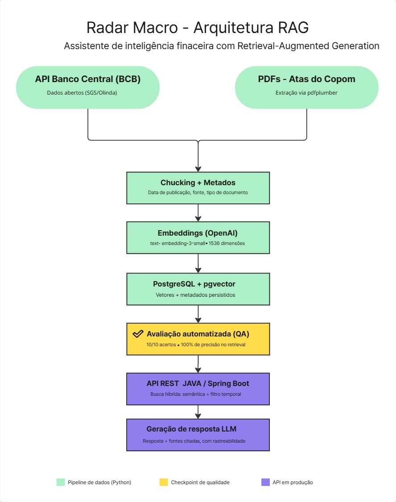

# Radar Macro - Assistente de Inteligência Financeira com RAG

Responde perguntas em linguagem natural sobre política monetária brasileira, buscando o contexto certo em Atas do Copom e dados oficiais do Banco Central antes de gerar a resposta, com rastreabilidade das fontes usadas.

## Arquitetura



> A etapa "Avaliação automatizada (QA)" no diagrama é um checkpoint de validação sob demanda, não uma etapa executada a cada requisição.

**Fluxo de uma requisição:**
1. `POST /api/rag/perguntar` recebe a pergunta
2. `LlmService` gera o embedding da pergunta (OpenAI `text-embedding-3-small`)
3. `BuscaService` executa busca híbrida no Postgres: filtro temporal (SQL) + similaridade semântica (`pgvector`, `<=>`)
4. Os trechos recuperados são injetados no prompt
5. `LlmService` chama a OpenAI para gerar a resposta final
6. A API retorna a resposta e as fontes usadas (data, origem, tipo de documento)

## Stack

| Camada | Tecnologia |
|---|---|
| Coleta de dados | Python + `requests` / `pdfplumber` |
| Backend / API | Java + Spring Boot |
| Banco vetorial | PostgreSQL + `pgvector` |
| Embeddings | OpenAI `text-embedding-3-small` (1536d) |
| Geração | OpenAI (chat completions) |

## Como rodar

```bash
# 1. Infraestrutura
docker-compose up -d

# 2. Popular a base de embeddings (Python)
.\venv\Scripts\Activate.ps1
pip install openai python-dotenv psycopg2
python gerar_embeddings.py

# 3. Subir a API (Java)
.\mvnw.cmd spring-boot:run

# 4. Testar
curl -X POST http://localhost:8080/api/rag/perguntar \
  -H "Content-Type: application/json" \
  -d '{"pergunta": "Qual foi a decisão sobre a taxa Selic?"}'

# 5. Rodar a avaliação de qualidade
python avaliacao_api.py
```

Variáveis de ambiente necessárias (`.env`, não versionado):
```
DB_HOST=localhost
DB_PORT=5432
DB_NAME=radar_macro
DB_USER=<seu_usuario>
DB_PASSWORD=<sua_senha>
OPENAI_API_KEY=<sua_chave>
```

## Avaliação de qualidade
Conjunto de 10 perguntas-teste executado contra a API em produção (`avaliacao_api.py`), não contra o banco isoladamente.

**Resultado:** 10/10 — 100% de precisão na recuperação de contexto.

## Princípios de engenharia aplicados
- **Separation of Concerns**: Controller → Service → acesso a dados via `JdbcTemplate`
- **Configuração externa (12-factor)**: credenciais via variáveis de ambiente, nunca commitadas
- **Rastreabilidade**: toda resposta retorna as fontes usadas
- **Guardrail contra alucinação**: prompt restringe o modelo ao contexto recuperado
- **Testabilidade**: avaliação automatizada rodando contra a API real
- **Idempotência**: reprocessar embeddings não duplica dados

## Decisões de arquitetura
Bugs e decisões técnicas relevantes estão documentados em formato ADR em [`docs/decisions.md`](./docs/decisions.md).
